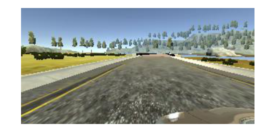
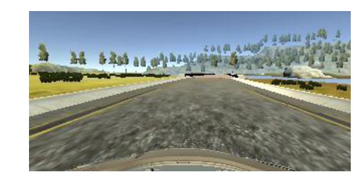
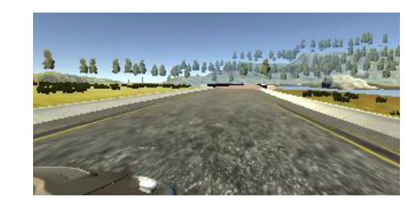
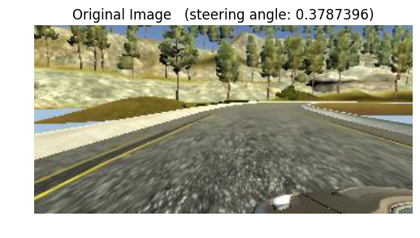
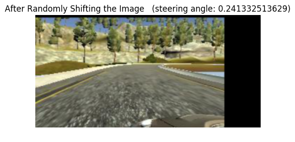
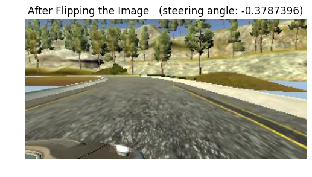
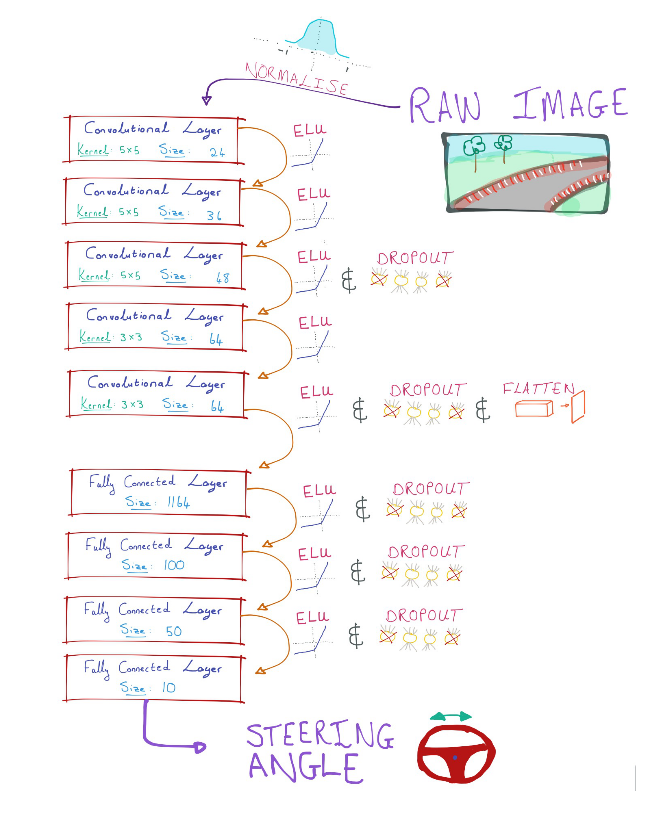

# Udacity SDCND:  Behavioural Cloning

Learning to mimik human driving behaviour in a simulator using a Convolutional Neural Network.


(https://youtu.be/3a00A8EYMmI)

## The Process:

Import the CSV file and keep only the data with a throttle of greater than .25 applied. This ensures greater consistency and a smaller propensity of the model to tend towards zero values.
<br><br>
Next we shuffle the data and split it into a testing set and a training set.


```python
df = pd.read_csv('./data/driving_log.csv', header = 0)
df = df[df['throttle']>.25].append(df.iloc[50:110])
```


```python
shuffled_df = df.sample(len(df)).reset_index()
df_train = shuffled_df[:6500]
df_valid = shuffled_df[6500:]
```

### Data Exploration


```python
df.head()
```


<div>
<table border="1" class="dataframe">
  <thead>
    <tr style="text-align: right;">
      <th></th>
      <th>center</th>
      <th>left</th>
      <th>right</th>
      <th>steering</th>
      <th>throttle</th>
      <th>brake</th>
      <th>speed</th>
    </tr>
  </thead>
  <tbody>
    <tr>
      <th>50</th>
      <td>IMG/center_2016_12_01_13_32_43_357.jpg</td>
      <td>IMG/left_2016_12_01_13_32_43_357.jpg</td>
      <td>IMG/right_2016_12_01_13_32_43_357.jpg</td>
      <td>0.000000</td>
      <td>0.735778</td>
      <td>0.0</td>
      <td>0.953669</td>
    </tr>
    <tr>
      <th>51</th>
      <td>IMG/center_2016_12_01_13_32_43_457.jpg</td>
      <td>IMG/left_2016_12_01_13_32_43_457.jpg</td>
      <td>IMG/right_2016_12_01_13_32_43_457.jpg</td>
      <td>0.061760</td>
      <td>0.985533</td>
      <td>0.0</td>
      <td>2.124567</td>
    </tr>
    <tr>
      <th>52</th>
      <td>IMG/center_2016_12_01_13_32_43_558.jpg</td>
      <td>IMG/left_2016_12_01_13_32_43_558.jpg</td>
      <td>IMG/right_2016_12_01_13_32_43_558.jpg</td>
      <td>0.052191</td>
      <td>0.985533</td>
      <td>0.0</td>
      <td>3.286475</td>
    </tr>
    <tr>
      <th>53</th>
      <td>IMG/center_2016_12_01_13_32_43_659.jpg</td>
      <td>IMG/left_2016_12_01_13_32_43_659.jpg</td>
      <td>IMG/right_2016_12_01_13_32_43_659.jpg</td>
      <td>0.052191</td>
      <td>0.985533</td>
      <td>0.0</td>
      <td>4.440864</td>
    </tr>
    <tr>
      <th>54</th>
      <td>IMG/center_2016_12_01_13_32_43_761.jpg</td>
      <td>IMG/left_2016_12_01_13_32_43_761.jpg</td>
      <td>IMG/right_2016_12_01_13_32_43_761.jpg</td>
      <td>0.367953</td>
      <td>0.985533</td>
      <td>0.0</td>
      <td>5.565724</td>
    </tr>
  </tbody>
</table>
</div>


We can see that the dataset consists of left, center and right images taken at successive time intervals.  For each image set, we also have a steering, throttle, brake and speed value.
<br><br>
Taking a look at the individual images:










As expected, images taken from the center, left and right of the hood of the car.  We will use all 3 images, after adjusting the steering angles, of the selected timesteps (throttle > .25) in order to make maximum use of the data we have (and to train for recovery without explicitly generating too much training data for it - which could be tedious).

### Data Augmentation
As described in NVIDIA's paper on end-to-end-learning (https://devblogs.nvidia.com/parallelforall/deep-learning-self-driving-cars/), we augment the training data by varying the brightness, shifting the image and flipping the image at random. <br>
Credit: Dr Vivek Yadav, "Learning human driving behavior using NVIDIA’s neural network model and image augmentation." - https://chatbotslife.com/learning-human-driving-behavior-using-nvidias-neural-network-model-and-image-augmentation-80399360efee#.ypdb28rdr


```python
def rdm_brightness(image):
    hsv_img = cv2.cvtColor(image, cv2.COLOR_RGB2HSV)
    hsv_img[:,:,2] = hsv_img[:,:,2]*uniform(low=0.25, high=1.25)
    return cv2.cvtColor(hsv_img,cv2.COLOR_HSV2RGB)

def rdm_shift_image(image, steering):
    Δx = uniform(low = -1, high = 1)
    Δy = uniform(low = -5, high = 5)
    translation = np.float32([ [1, 0, Δx*75], [0, 1, Δy] ])
    steering += Δx/5
    return cv2.warpAffine(image, translation, image.shape[:2][::-1]), steering

def rdm_flip_image(image, steering_angle):
    if uniform() < 0.5:
        return cv2.flip(image,1), -steering_angle
    return image, steering_angle
```


```python
def image_and_steering_from_file(file, center_only = False):
    image = cv2.imread('./data/' + file['center'])
    steering = file['steering']
    
    if not center_only:
        rv = uniform()
        if rv < 1/3:
            image = cv2.imread('./data/' + file['left'].lstrip())
            steering += .25
        elif rv < 2/3:
            image = cv2.imread('./data/' + file['right'].lstrip())
            steering += -.25
        
    return cv2.cvtColor(image,cv2.COLOR_BGR2RGB), steering
```


We visualise the effects of these augmentation techniques:


```python
image, steering = image_and_steering_from_file(df.iloc[180])
plt.title("Original Image "+"  (steering angle: "+str(steering)+")")
plt.imshow(image)
plt.axis('off')
plt.show();

plt.title("After Brightness Variation")
plt.imshow(rdm_brightness(image))
plt.axis('off')
plt.show();

image_shift, steering_shift = rdm_shift_image(image, steering)
plt.title("After Randomly Shifting the Image "+"  (steering angle: "+str(steering_shift)+")")
plt.imshow(image_shift)
plt.axis('off')
plt.show();

image_flip, steering_flip = rdm_flip_image(image, steering)
plt.title("After Flipping the Image "+"  (steering angle: "+str(steering_flip)+")")
plt.imshow(image_flip)
plt.axis('off')
plt.show();
```











We then crop the image to exclude the car and the sky, after which we resize the image to a square 66x66 image (for simplicity and a smaller model size).


```python
def crop_and_resize(image):
    shape = image.shape
    image = image[40:shape[0]-25,:]
    image = cv2.resize(image,(66,66), interpolation=cv2.INTER_AREA) 
    return np.array(image)
```


### Generators
Next we set up a batch generator so that all the images need not be kept in memory at training time. One for training and one for validation.


```python
def batch_generator_train(data, batch_size = 32):
    while True:
        images = np.zeros((batch_size, 66, 66, 3))
        steering_values = np.zeros(batch_size)
        
        for i in range(batch_size):
            file = data.iloc[randint(len(data))]
            image, steering = rdm_flip_image(*rdm_shift_image(*image_and_steering_from_file(file)))
            image = crop_and_resize(rdm_brightness(image))
            image = cv2.cvtColor(image, cv2.COLOR_BGR2YUV)
            
            images[i] = image
            steering_values[i] = steering
            
        yield images, steering_values
```


```python
def batch_generator_validation(data):
    while True:
        for i in range(len(data)):
            file = data.iloc[i]
            image, steering = image_and_steering_from_file(file, center_only = True)
            image = crop_and_resize(image)
            image = cv2.cvtColor(image, cv2.COLOR_BGR2YUV)
            
            yield image.reshape(1, *image.shape), np.array([[steering]])
```

### Convolutional Neural Network
Next is the building of the actual model, using Keras (with a tensorflow backend). <br>
The model is built after the model described in NVIDIA's paper. <br>
It consists of a typical convolutional neural network, with 5 convolutional layers and 4 fully-connected layers.  It starts out with a normalization layer, which normalizes pixel values to be between -1 and 1.  Then follow 3 convolutional layers with a 5x5 kernel each, and 2 convolutional layers with a 3x3 kernel each. We use an ELU to provide some nonlinearity between the layers; and - in order to reduce over-fitting, we use dropout throughout the network. <br>
<br>
Figure: Convnet Structure


```python
plt.figure(figsize=(10,10))
plt.imshow(plt.imread("FullSizeRender.jpg"))
plt.axis('off')
plt.show();
```





```python
model = Sequential()
model.add(Lambda(lambda x: x/255.-0.5, input_shape=(66, 66, 3)))

model.add(Convolution2D(24, 5,5, subsample=(2,2)))
model.add(ELU())
model.add(Convolution2D(36, 5,5, subsample=(2,2)))
model.add(ELU())
model.add(Convolution2D(48, 5,5))
model.add(ELU())

model.add(Dropout(0.5))

model.add(Convolution2D(64, 3,3))
model.add(ELU())
model.add(Convolution2D(64, 3,3))
model.add(ELU())
          
model.add(Dropout(0.5))
          
model.add(Flatten())
model.add(Dense(1164))
model.add(ELU())
model.add(Dropout(0.5))
model.add(Dense(100))
model.add(ELU())
model.add(Dropout(0.5))
model.add(Dense(50))
model.add(ELU())
model.add(Dropout(0.5))
model.add(Dense(10))
model.add(ELU())
model.add(Dropout(0.5))
model.add(Dense(1))

model.compile(optimizer=Adam(), loss='mse')
```

### Training
Using the Adam optimizer, we can now fit the convnet to our data. <br>
Using my generators defined earlier, I generate training batches of length 128 each, and fit the model with 30 epochs of sample length equal to the training set (6000). <br>
I validate the training using the validation set generator I defined earlier.


```python
train_gen = batch_generator_train(df_train,128)
valid_gen = batch_generator_validation(df_valid)

history = model.fit_generator(train_gen, samples_per_epoch=len(df_train), nb_epoch=30, validation_data = valid_gen, nb_val_samples = len(df_valid))
model.save('MyModel_YES_INTERPOLATION_NEW_30.h5')
```

# Results

### Simulator Track 1

[]
(https://youtu.be/3a00A8EYMmI)
